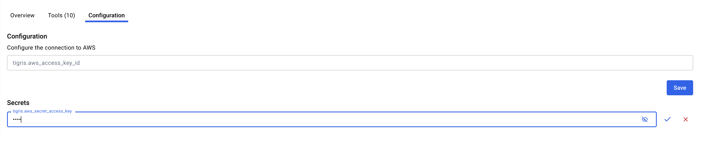

# 🤝 Contributing to Docker MCP Registry

Thank you for your interest in contributing to the official Docker MCP Registry.
This document outlines how to contribute to this project.

## Prerequisites

- Go v1.24+
- [Docker Desktop](https://www.docker.com/products/docker-desktop/)
- [Task](https://taskfile.dev/)

## 🔄 Pull request process overview

- Make sure that the license of your MCP Server allows people to consume it. (MIT or Apache 2 are great, GPL is not).
- Fork the repository to your own GitHub account and clone it locally.
- Repository includes a `servers` folder where you should add a new folder with a `server.yaml` inside.
- Repository includes a `cmd` folder with Go code to automate some of the steps.
- Open a PR by ensuring the title and its description reflect the content of the PR.
- Ensure that CI passes, if it fails, fix the failures.
- Every pull request requires a review from the Docker team before merging.
- Once approved, all of your commits will be squashed into a single commit with your PR title.

## 📋 Step-by-Step Guide

### 1️⃣ Fork this repository

Fork the repository to your own GitHub account and clone it locally.

### 2️⃣ Add your entry locally

#### 🚀 Generate your server configuration using `task wizard`

```
task wizard
```

Using the wizard it's the easiest way to create your `server.yaml`, you first need to provide a valid github repo with a Dockerfile, which the wizard will analyze to populate the server default values (you can overwrite them directly in the wizard if you need to).

The wizard allows you to add environment variables, secrets and volumes.

#### 🚀 Alternatively: Generate your server configuration using `task create`

You can use our command to automate the creation of the files. Let's assume we have a new MCP Server to access my org's database. My server's GitHub repo is located at: `https://github.com/myorg/my-orgdb-mcp`

You can call the creation tool passing the category (required), and github url. If your server requires any environment variables, pass them at the end with `-e KEY=value`.

```
task create -- --category database https://github.com/myorg/my-orgdb-mcp -e API_TOKEN=test
```

This will build an image using the Dockerfile at the root of the repository, run it while verifying the MCP server is able to list tools, and then create the necessary files. It will create a directory under `servers` as follows: `./servers/my-orgdb-mcp` and inside you will find a `server.yaml` file with your MCP definition.

```
name: my-orgdb-mcp
image: mcp/my-orgdb-mcp
type: server
meta:
  category: database
  tags:
    - database
about:
  title: My OrgDB MCP (TODO)
  description: TODO (only to provide a better description than the upstream project)
  icon: https://avatars.githubusercontent.com/u/182288589?s=200&v=4
source:
  project: https://github.com/myorg/my-orgdb-mcp
config:
  description: Configure the connection to TODO
  secrets:
    - name: my-orgdb-mcp.api_token
      env: API_TOKEN
      example: <API_TOKEN>
```

Remember that you need to specify all the env vars that you want to use in your server:

```
task create -- --category database https://github.com/myorg/my-orgdb-mcp -e API_TOKEN=test -e MY_ORG=my-org
```

If you don't specify all the environment variables, users will not be able to configure them properly in the UI.

Also, it's important to notice that env vars and secrets are handled differently. This is how a config block looks:

```
config:
  description: Configure the connection to AWS
  secrets:
    - name: tigris.aws_secret_access_key
      env: AWS_SECRET_ACCESS_KEY
      example: YOUR_SECRET_ACCESS_KEY_HERE
  env:
    - name: AWS_ACCESS_KEY_ID
      example: YOUR_ACCESS_KEY_HERE
      value: '{{tigris.aws_access_key_id}}'
    - name: AWS_ENDPOINT_URL_S3
      example: https://fly.storage.tigris.dev
      value: '{{tigris.aws_endpoint_url_s3}}'
  parameters:
    type: object
    properties:
      aws_access_key_id:
        type: string
    required:
      - aws_access_key_id

```

This configuration will provide the following UI:



If you want to provide a specific Docker image built by your organisation instead of having Docker build the image, you can specify it with the `--image` flag:

```
task create -- --category database --image myorg/my-mcp https://github.com/myorg/my-orgdb-mcp -e API_TOKEN=test
```

🔒 If you don't provide a Docker image, we will build the image for you and host it in [Docker Hub's `mcp` namespace](https://hub.docker.com/u/mcp), the benefits are: image will include cryptographic signatures, provenance tracking, SBOMs, and automatic security updates. Otherwise, self-built images still benefit from container isolation but won't include the enhanced security features of Docker-built images.

### 3️⃣ Run & Test your MCP Server locally

After creating your server file with `task create`, you will be given instructions for running it locally. In the case of my-orgdb-mcp, we would run the following commands next.

```
task build -- my-orgdb-mcp # Not needed if providing your own image
task catalog -- my-orgdb-mcp
docker mcp catalog import $PWD/catalogs/my-orgdb-mcp/catalog.yaml
```

Now, if we go into the MCP Toolkit on Docker Desktop, we'll see our new MCP server there! We can configure and enable it there, and test it against configured clients. Once we're done testing, we can restore it back to the original Docker catalog.

```
docker mcp catalog reset
```

### 4️⃣ Wait for review and approval

Upon approval your entry will be processed and it will be available in 24 hours at:

- [MCP catalog](https://hub.docker.com/mcp)
- [Docker Desktop's MCP Toolkit](https://www.docker.com/products/docker-desktop/)
- [Docker Hub `mcp` namespace](https://hub.docker.com/u/mcp) (for MCP servers built by Docker)

## 📜 Code of Conduct

This project follows a Code of Conduct. Please review it in
[CODE_OF_CONDUCT.md](CODE_OF_CONDUCT.md).

## ❓ Questions

If you have questions, please create an issue in the repository.

## 📄 License

By contributing, you agree that your contributions will be licensed under the MIT License.
